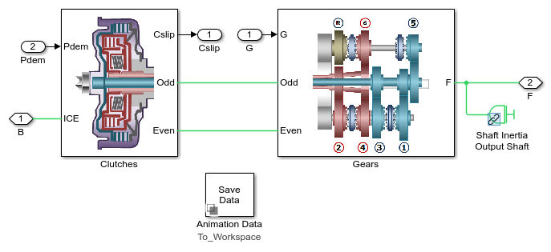

# **Vehicle with a Dual-Clutch Transmission**

View on File Exchange:   
You can also open in MATLAB Online: 

This model contains a dual-clutch transmission built using Simscape and 
Simscape Driveline that can be configured for control algorithm development 
or optimization tests. The clutch states and pre-selection of the gears 
via dog clutches is controlled by a state machine modeled in Stateflow. 

Model variants for the transmission and vehicle dynamics can be selected 
using variant subsystems. MATLAB scripts demonstrate how to optimize a shift 
schedule for maximum fuel economy, and how to speed that process using 
parallel computing. This model can be configured for hardware-in-the-loop testing. 

## **Getting Started**
You must open the project Dual_Clutch_Trans.prj to set the path and load key values.

## **Model Overview**

Copyright 2013-2025 The MathWorks, Inc.

Note: the project does not place generated files in the work folder 
because the Simulink.BlockDiagram.buildRapidAcceleratorTarget
method needs that code to be in a local folder.

